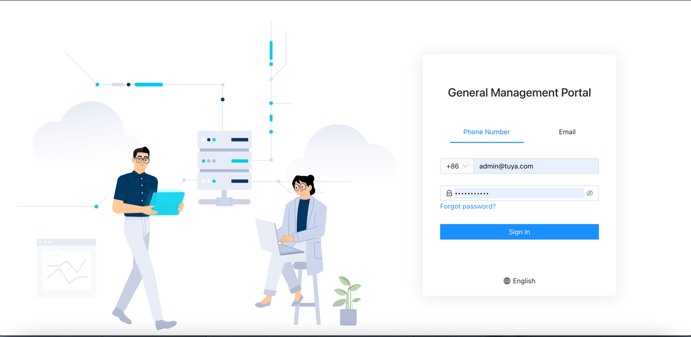
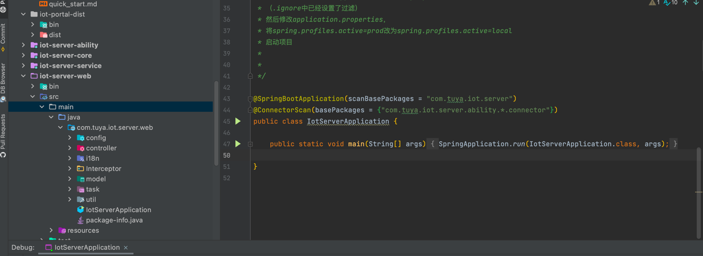

# Iot Server

[中文版](README_zh.md) | [English](README.md)

## Introduce
`iot-server` is a Saas public version unified control console application based on Tuya Cloud, which allows developers to quickly implement, flexibly integrate, and freely expand Tuya Cloud’s industry capabilities. At present, the framework has built-in and integrated features common to the Tuya cloud industry, which can be used out of the box and deployed with one click.

The unified management platform is associated with the projectCode of the cloud development platform project, and you need to log in with the user information corresponding to the projectCode, which mainly includes the following features:

- Account management: Modify and reset passwords.

- Asset management: Create, modify, and delete assets.

- Device management: Add, edit, control, and remove devices.

- Permission control: create a new role, set permission items, and remake permissions

## Version

| Framework | release Version | JDK Version | Spring-boot dependence | 
| -------------- | ------------- |------------- |------------- |
| iot-server| 1.0.0 ~ 1.1.2 | 1.8`↑` |  1.5.x.RELEASE `↑` |
| iot-server| 1.1.3 ~ 1.1.x| 1.8`↑` |  2.5.3.RELEASE `↑` |

## File structure

The project code structure is as follows:
* **iot-portal-dist**: The front end is a packaged resource file containing the server.js script used as a reverse proxy.(like Nginx)
---
* **iot-server-core**: Common layer, providing common tools and models
* **iot-server-ability**: Capability layer, which defines the cloud platform interface
* **iot-server-service**: The business logic layer, which implements the developer's custom business logic
* **iot-server-web**: web interface layer, providing front-end external call interface

##  How to use IoT Server
We have prepared an article for you [IOT Server Quick Start](https://developer.tuya.com/cn/docs/iot/SaaSDevelopmentFramework_backend?id=Kaqcx9hwc9i62)

You can also learn about the complete SaaS Development Framework system [SaaS Development Dramework](https://developer.tuya.com/cn/docs/iot/SaaSDevelopmentFramework?id=Kaps8jd0mowem)

## Quick start：
### Start front-end static resources：
    1.Installing the Node Environment
    2.Run the cd {project.dir}iot-portal-dist/bin command to go to the directory
    3.Enter node server.js Start the reverse proxy for the front-end resource
    4.Open http://127.0.0.1:8888 and going to the front page
---

Take a look at all of our front-end projects if you want to learn and customize your front-end code： [iot-portal](https://github.com/tuya/iot-portal)

### Start back-end services：
    1.Use IntelliJ IDEA to open the iot-server project
    2.Configure connector.ak, connector.sk, and project.code in the iot-server-Web
    3.Start IotServerApplication

### Login and experience:
    Default Administrator account：admin@tuya.com
    Default Administrator password：Admin123456
---

## Documents

Please refer to the front-end project address: [iot-portal](https://github.com/tuya/iot-portal).

Iot Server bottom cloud docking [tuya-connector](https://github.com/tuya/tuya-connector/tree/f62deb6c4738d7e80868268b29379c647798ed9c) You can refer to the documentation for more information.

More about Tuya Cloud openapi interface can be viewed [Doc](https://developer.tuya.com/cn/docs/iot/api-reference?id=Ka7qb7vhber64).

All notifications can also be found here [Github notice issue](https://github.com/tuya/iot-server/issues).

## Bug 和 Feedback
For bug reports, questions and discussions please submit to [GitHub Issue](https://github.com/tuya/iot-server/issues)

### Technical support

You can get technical support from Tuya in the following services:

Help Center: https://support.tuya.com/en/help

Service & Support: https://service.console.tuya.com

## Licenses

For more information, please refer to the [LICENSE](LICENSE).

