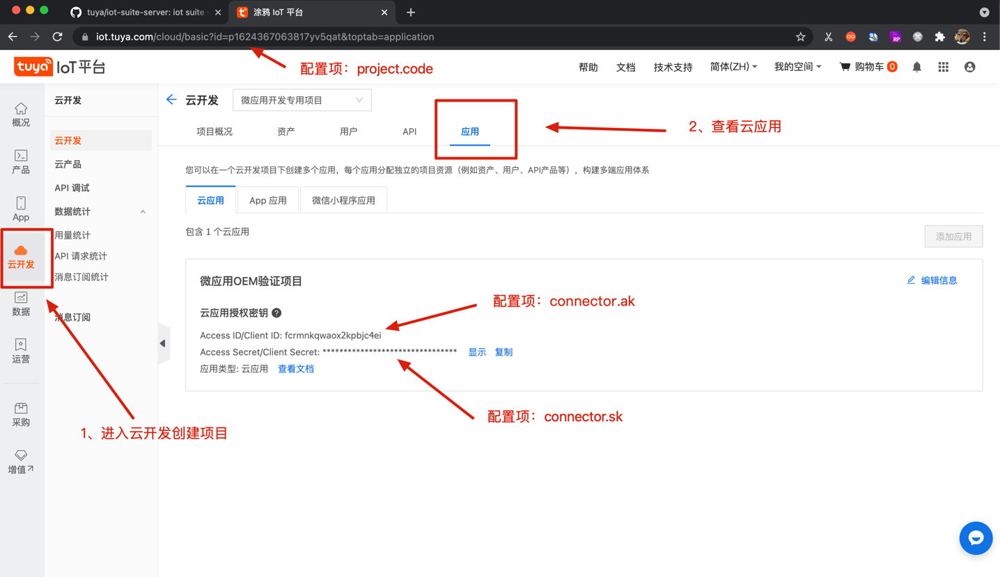

[中文版](README_zh.md) | [English](README.md)  


# 统一管理平台
## 介绍
统一管理平台是实现云端行业能力，能灵活集成、扩展 IoT 的统一管控台应用。

该统一管理平台与云开发平台项目的 projectCode 做关联，需要使用 projectCode 对应的用户信息登录，主要包括以下内容：

账号管理：修改密码、重置密码

资产管理：创建资产、修改资产、删除资产等

设备管理：增加设备、移除设备、编辑设备、控制设备  

前端项目地址 [iot-portal](https://github.com/tuya/iot-portal)


## 启动项目
### 1. 拉取项目代码, 并导入IDE
   > git clone https://github.com/tuya/iot-suite-server.git
### 2. 参数配置
   #### 云项目账号（必填）
   在 iot-suite-server-web 下的 `application.properties` 文件中配置开发者自己的云开发平台应用的账号
   ```properties
   # 在云开发平台申请的Access ID/Client ID/Project Code
   connector.ak=
   connector.sk=
   project.code=
   ```


   #### 模板 ID（非必填）
   找回密码功能中使用到<b>短信</b>和<b>邮件</b>的推送，需要开发者提前申请模板
   * 邮件模板申请：[https://developer.tuya.com/cn/docs/cloud/3f377cbcd3?id=Kagouv5mzqgdb](https://developer.tuya.com/cn/docs/cloud/3f377cbcd3?id=Kagouv5mzqgdb)
   * 短信模板申请：[https://developer.tuya.com/cn/docs/cloud/7a37355b05?id=Kagp29so0orah](https://developer.tuya.com/cn/docs/cloud/7a37355b05?id=Kagp29so0orah)

   在 iot-suite-server-web 下的 `application.properties` 填入申请后的模板ID
   ```properties
#短信中文模板
captcha.notice.resetPassword.sms.templateId.cn=
#短信英文模板
captcha.notice.resetPassword.sms.templateId.en=
#邮件中文模板
captcha.notice.resetPassword.mail.templateId.cn=
#邮件中文模板
captcha.notice.resetPassword.mail.templateId.en=
   ```
注：
* 模板申请参数格式为 `{"code": "%s","timeLimit": "%d"}`
* 如果不使用找回密码功能，无需申请模板

### 3. 构建项目
   执行如下命令构建可运行 jar 包，输出路径在 `iot-suite-server-web/target`
   > mvn clean install -U -Dmaven.test.skip=true

### 4. 运行项目
   
   > java -jar iot-suite-server-web/target/iot-suite-server-{version}.jar

### 如何获得技术支持

可以通过以下链接获得帮助

涂鸦智能帮助中心:[https://support.tuya.com/en/help](https://support.tuya.com/en/help "https://support.tuya.com/en/help")

涂鸦智能全球化智能平台:[https://service.console.tuya.com ](https://service.console.tuya.com  "https://service.console.tuya.com ")

