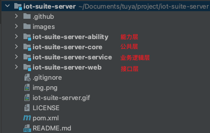
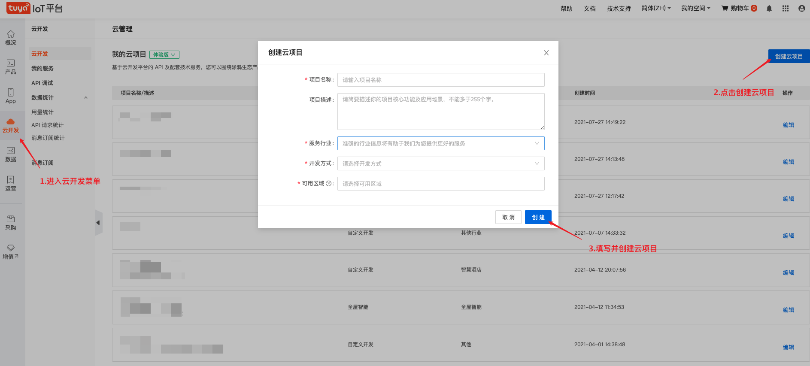
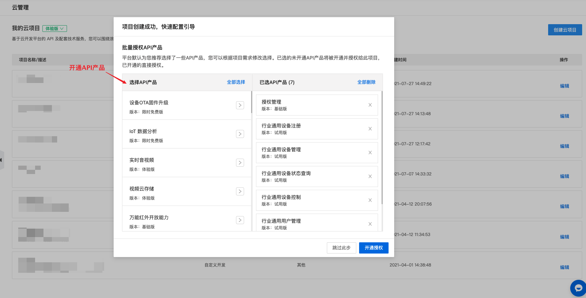
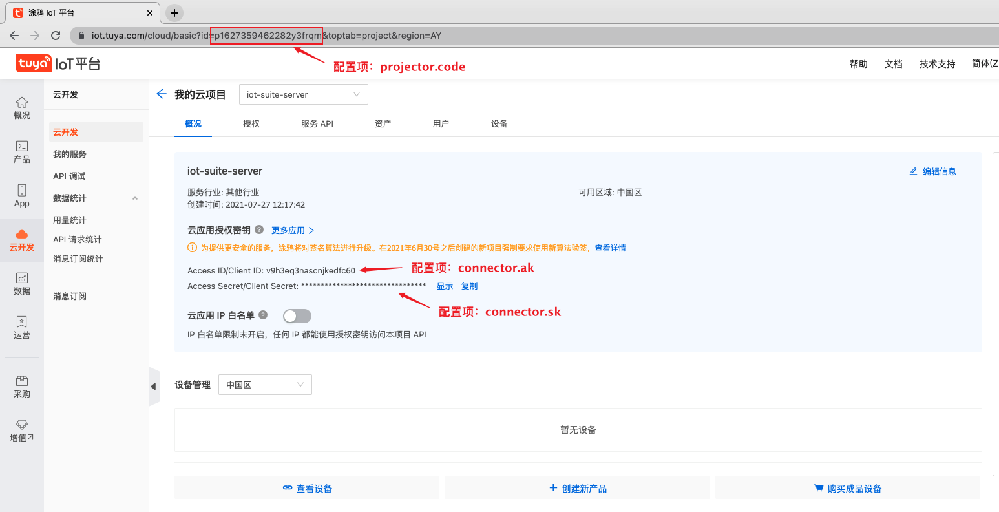
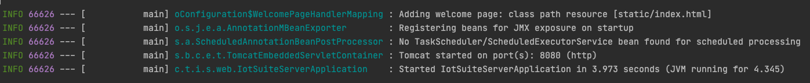
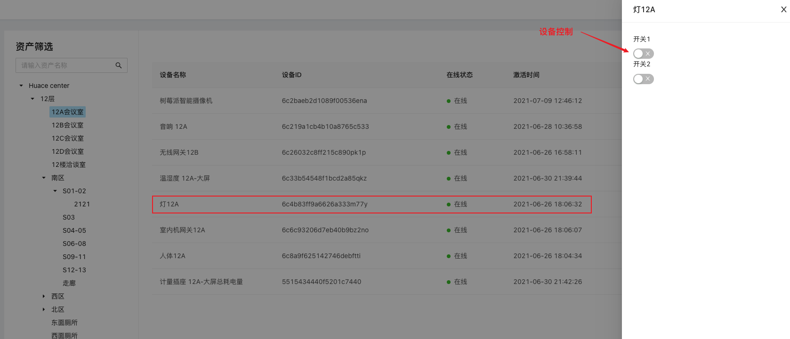

# Iot Server

[中文版](README_zh.md) | [English](README.md)

## 介绍
Iot Suite Server 是实现云端行业能力，能灵活集成、扩展 IoT 的统一管控台后端服务应用。

该统一管理平台与云开发平台项目的 projectCode 做关联，需要使用 projectCode 对应的用户信息登录，主要包括以下特性功能：

* 账号管理：修改密码、重置密码
* 资产管理：创建资产、修改资产、删除资产等
* 设备管理：增加设备、移除设备、编辑设备、控制设备


## 文档

前端项目地址请参阅: [iot-portal](https://github.com/tuya/iot-portal)

Iot Server 底层云端对接使用 [tuya-connector]() 实现，你可以参考文档获得更多的信息。

关于更多涂鸦云端 openapi 接口可以查看 [文档](https://developer.tuya.com/cn/docs/iot/api-reference?id=Ka7qb7vhber64) 。

所有最新和长期的通知也可以在这里找到 [Github notice issue](https://github.com/tuya/iot-suite-server/issues) 。


## 快速启动

下面是一个简单的演示步骤，指导新用户如何启动项目并基于 Iot Server 做二次开发和自定义功能拓展。

注意： 开发预先安装 <b>mavenM</b> 和 <b>jdk</b> 环境（jdk版本需要 1.8 或更高版本）

### 准备工作

#### 1. 拉取 git 项目代码
   > git clone https://github.com/tuya/iot-suite-server.git

   项目代码结构如下：

   


#### 2. 创建云项目

   开发者需要登录 [云开发平台](https://iot.tuya.com/cloud/) 创建云项目，如下图步骤所示：   
   

   项目创建成功后会弹出项目需要开通的 API 产品页面，开发者需要开通以下产品：
* 授权管理
* 行业通用设备注册
* 行业通用设备管理
* 行业通用设备状态查询
* 行业通用设备控制
* 行业通用用户管理
* 行业通用资产管理

   

### 参数配置
   #### 1. 云项目账号（必填）
   开发者需要将上面步骤创建的云项目账号信息填写到项目中，如下图所示:   

   配置文件路径为：`iot-server/iot-server-web/application.properties`

   ```properties
   # 在云开发平台申请的Access ID/Client ID/Project Code
   connector.ak=
   connector.sk=
   project.code=
   ```

   #### 2. 短信邮件推送（非必填）
   找回密码功能中使用到<b>短信</b>和<b>邮件</b>的推送，如需使用此功能需要开发者提前**申请模板**
   * 邮件模板申请：[https://developer.tuya.com/cn/docs/cloud/3f377cbcd3?id=Kagouv5mzqgdb](https://developer.tuya.com/cn/docs/cloud/3f377cbcd3?id=Kagouv5mzqgdb)
   * 短信模板申请：[https://developer.tuya.com/cn/docs/cloud/7a37355b05?id=Kagp29so0orah](https://developer.tuya.com/cn/docs/cloud/7a37355b05?id=Kagp29so0orah)

   将申请好的模板 ID 填入配置文件，配置文件路径为：`iot-server/iot-server-web/application.properties`

   ```properties
#短信中文模板
captcha.notice.resetPassword.sms.templateId.cn=
#短信英文模板
captcha.notice.resetPassword.sms.templateId.en=
#邮件中文模板
captcha.notice.resetPassword.mail.templateId.cn=
#邮件英文模板
captcha.notice.resetPassword.mail.templateId.en=
   ```
注意：
* 申请的模板参数格式固定为： `{"code": "%s","timeLimit": "%d"}`
* 如果不使用找回密码功能，无需申请模板

### 构建 & 运行
   执行如下命令，构建并运行项目

* maven 构建项目

  > cd ./iot-server/iot-server-web
  >
  > mvn -U clean package spring-boot:repackage -Dmaven.test.skip=true

  

* 执行可运行 jar 包

  > java -jar ./target/iot-server-web-{version}.jar

   等待终端输出如下信息，即服务运行成功，可结合前端项目体验整体系统流程
   


   如果开发者使用 idea 导入，可以参照下面动图启动服务：
   


### 案例分析

比如目前 iot-server 已支持的设备指令下发功能：



#### 1. 定义 ability
对于设备控制的 API 接口可以查看[云开发平台文档](https://developer.tuya.com/cn/docs/cloud/e2512fb901?id=Kag2yag3tiqn5)

在 iot-web-ability 模块根据接口文档定义 ability 接口：

```java
public interface DeviceAbility {
  @Override
	@POST("/v1.0/iot-03/devices/{device_id}/commands")
	Boolean commandDevice(@Path("device_id") String deviceId, @Body DeviceCommandRequest request);
}
```

#### 2. 实现业务逻辑

在 iot-server-service 模块中实现业务层逻辑，可以使用 @Autowired 方式注入 ablity 接口

```java
@Service
public class DeviceServiceImpl implements DeviceService {
	@Autowired
  private DeviceAbility deviceAbility;
  
  @Override
  public Boolean commandDevice(String deviceId, DeviceCommandRequest request) {
    return deviceAbility.commandDevice(deviceId, request);
  }
}
```

#### 3. web接口层
在 iot-server-web 模块定义对外提供的 api 接口

```java
@Service
public class DeviceServiceImpl implements DeviceService {
	@Autowired
  private DeviceAbility deviceAbility;
  
  @Override
  public Boolean commandDevice(String deviceId, DeviceCommandRequest request) {
    return deviceAbility.commandDevice(deviceId, request);
  }
}
```

   

## 版本列表

| 框架 | release 版本 | JDK 版本 | Spring-boot 依赖 | 
| -------------- | ------------- |------------- |------------- |
| iot-server| 1.0.0 ~ 1.1.2 | 1.8`↑` |  1.5.x.RELEASE `↑` |

## Bug 和 反馈
对于错误报告，问题和讨论请提交到 [GitHub Issue](https://github.com/tuya/iot-suite-server/issues)

## 如何获得技术支持

可以通过以下链接获得帮助

* 涂鸦智能帮助中心:[https://support.tuya.com/en/help](https://support.tuya.com/en/help "https://support.tuya.com/en/help")

* 涂鸦智能全球化智能平台:[https://service.console.tuya.com ](https://service.console.tuya.com  "https://service.console.tuya.com ")

欢迎加入微信群参与讨论分享：


## Licenses

更多信息，请参考 [LICENSE](LICENSE)  文件。