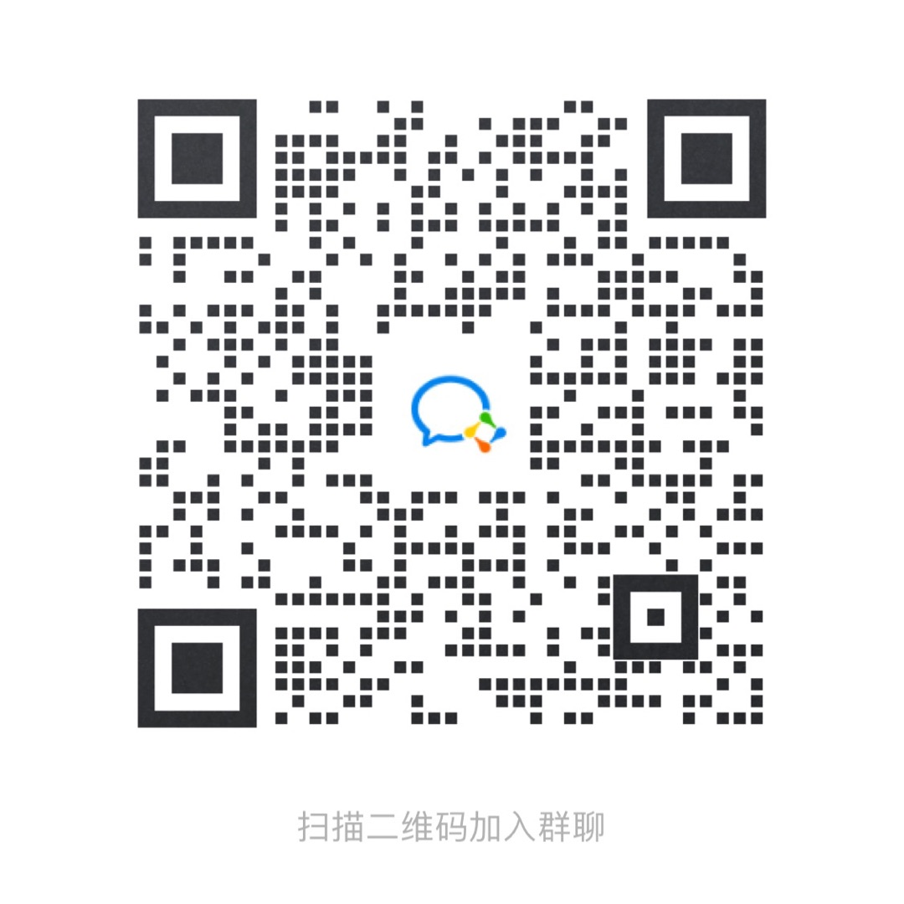

# Iot Suite Server

[中文版](README_zh.md) | [English](README.md)

## 介绍
Iot Suite Server 是实现云端行业能力，能灵活集成、扩展 IoT 的统一管控台后端服务应用。

该统一管理平台与云开发平台项目的 projectCode 做关联，需要使用 projectCode 对应的用户信息登录，主要包括以下特性功能：

* 账号管理：修改密码、重置密码

* 资产管理：创建资产、修改资产、删除资产等

* 设备管理：增加设备、移除设备、编辑设备、控制设备

## 文档

前端项目地址请参阅 [iot-portal](https://github.com/tuya/iot-portal)

关于更多涂鸦云端 openapi 接口可以查看 [文档](https://developer.tuya.com/cn/docs/iot/api-reference?id=Ka7qb7vhber64) 。

iot-suite-server 底层云端对接使用 [tuya-connector]() 实现，你可以参考文档获得更多的信息。

所有最新和长期的通知也可以在这里找到 [Github notice issue](https://github.com/tuya/iot-suite-server/issues)。

## 快速启动

下面是一个简单的演示步骤，指导新用户如何启动项目并基于 iot-suite-server 做二次开发和自定义功能拓展。

注意： 需要 JDK 1.8 或更高版本。

### 准备工作
#### 1. 拉取 git 项目代码, 并导入 IDE
   > git clone https://github.com/tuya/iot-suite-server.git
   
   项目代码结构如下：

   

#### 2. 创建云项目
   开发者需要登录[云开发平台](https://iot.tuya.com/cloud/) 创建云项目，如下图步骤所示：

   

   完整的操作步骤可以参照下面动图所示：
   

### 参数配置
   #### 1. 云项目账号（必填）
   开发者需要在 iot-suite-server 中配置上面步骤创建的云项目账号参数

   配置文件路径为：`iot-suite-server/iot-suite-server-web/application.properties`
   
   ```properties
   # 在云开发平台申请的Access ID/Client ID/Project Code
   connector.ak=
   connector.sk=
   project.code=
   ```

   #### 2. 模板 ID（非必填）
   找回密码功能中使用到<b>短信</b>和<b>邮件</b>的推送，如需使用此功能，需要开发者提前申请模板
   * 邮件模板申请：[https://developer.tuya.com/cn/docs/cloud/3f377cbcd3?id=Kagouv5mzqgdb](https://developer.tuya.com/cn/docs/cloud/3f377cbcd3?id=Kagouv5mzqgdb)
   * 短信模板申请：[https://developer.tuya.com/cn/docs/cloud/7a37355b05?id=Kagp29so0orah](https://developer.tuya.com/cn/docs/cloud/7a37355b05?id=Kagp29so0orah)

   将申请好的模板模板 ID 填入配置文件，配置文件路径为：`iot-suite-server/iot-suite-server-web/application.properties`

   ```properties
#短信中文模板
captcha.notice.resetPassword.sms.templateId.cn=
#短信英文模板
captcha.notice.resetPassword.sms.templateId.en=
#邮件中文模板
captcha.notice.resetPassword.mail.templateId.cn=
#邮件英文模板
captcha.notice.resetPassword.mail.templateId.en=
   ```
注：
* 模板申请参数格式固定为 `{"code": "%s","timeLimit": "%d"}`
* 如果不使用找回密码功能，无需申请模板

### 构建 & 运行
   执行如下命令，构建并运行项目 `./iot-suite-server`
   > mvn clean install -U -Dmaven.test.skip=true
   > 
   > cd ./iot-suite-server/iot-suite-server-web/target
   >
   > java -jar iot-suite-server-web/target/iot-suite-server-{version}.jar

### 案例开发


## 版本列表

| 框架 | release 版本 | JDK 版本 | Spring-boot 依赖 | 
| -------------- | ------------- |------------- |------------- |
| iot-suite-server| 1.0.0 ~ 1.1.2 | 1.8`↑` |  1.5.x.RELEASE `↑` |

## Bug 和 反馈
对于错误报告，问题和讨论请提交到 [GitHub Issue](https://github.com/tuya/iot-suite-server/issues)

## 如何获得技术支持

可以通过以下链接获得帮助

涂鸦智能帮助中心:[https://support.tuya.com/en/help](https://support.tuya.com/en/help "https://support.tuya.com/en/help")

涂鸦智能全球化智能平台:[https://service.console.tuya.com ](https://service.console.tuya.com  "https://service.console.tuya.com ")

欢迎加入微信群参与讨论分享：


