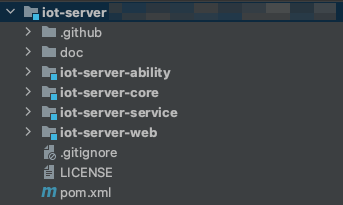
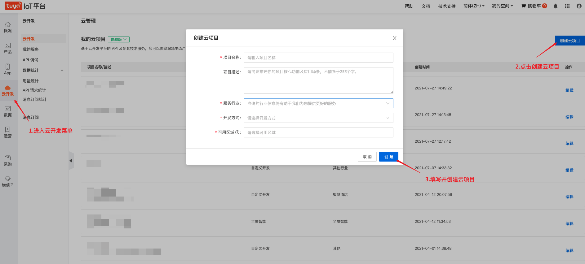
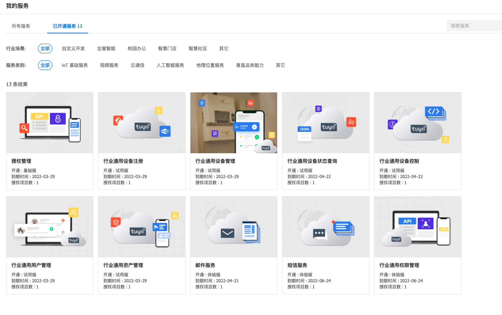
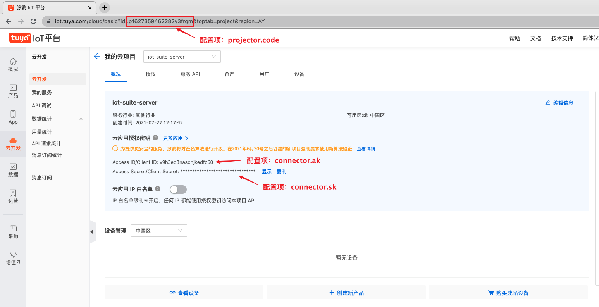
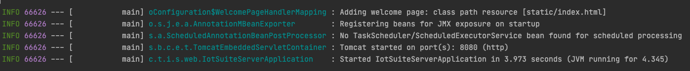
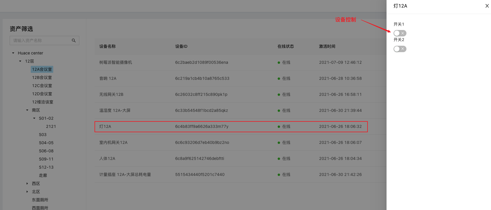

# 快速启动

[中文版](quick_start.md) | [English](quick_start_en.md)

## 本地运行 SaaS 开发框架后端项目

本文将介绍如何在本地配置运行SaaS 开发框架后端项目，基于此您可以做二次开发和自定义功能拓展。

## 前提条件
 - 安装JDK（jdk版本需要 1.8 或更高版本），具体请查看 [相关文档](https://www.oracle.com/java/technologies/javase-downloads.html)
 - 安装Maven，具体请查看 [相关文档](https://maven.apache.org/)


### 准备工作

#### 1. 拉取 git 仓库项目代码
   > git clone https://github.com/tuya/iot-server.git

   项目代码结构如下：

* **iot-server-core**: 公共层，提供通用工具和模型
* **iot-server-ability**: 能力层，定义云平台接口
* **iot-server-service**: 业务逻辑层，实现开发者自定义业务逻辑
* **iot-server-web**: web接口层，提供前端外部调用接口

   


#### 2. 创建云项目

   开发者需要登录 [云开发平台](https://iot.tuya.com/cloud/) 创建云项目，如下图步骤所示：   
   
   更多关于创建云开发项目的内容请查看[云开发快速入门](https://developer.tuya.com/cn/docs/iot/quick-start1?id=K95ztz9u9t89n) 步骤一和步骤二

   项目创建成功后会弹出项目需要开通的 API 产品页面，开发者需要开通以下产品：
* 授权管理
* 行业通用设备注册
* 行业通用设备管理
* 行业通用设备状态查询
* 行业通用设备控制
* 行业通用用户管理
* 行业通用资产管理
* 行业通用的权限管理

   
   更多关于创建云开发项目的内容请查看[云开发快速入门](https://developer.tuya.com/cn/docs/iot/quick-start1?id=K95ztz9u9t89n) 步骤四

### 参数配置
   #### 1. 云项目账号（必填）
   开发者需要将上面步骤创建的云项目账号信息填写到项目中，如下图所示: 
     

   配置文件路径为：`iot-server/iot-server-web/application.properties`

   ```properties
   # 在云开发平台申请的Access ID/Access Secret/Project Code
   connector.ak=
   connector.sk=
   project.code=
   ```

   #### 2. 短信邮件推送（非必填）
   找回密码功能中使用到<b>短信</b>和<b>邮件</b>的推送，如需使用此功能需要开发者提前**申请模板**
   * 邮件模板申请：[https://developer.tuya.com/cn/docs/cloud/3f377cbcd3?id=Kagouv5mzqgdb](https://developer.tuya.com/cn/docs/cloud/3f377cbcd3?id=Kagouv5mzqgdb)
   * 短信模板申请：[https://developer.tuya.com/cn/docs/cloud/7a37355b05?id=Kagp29so0orah](https://developer.tuya.com/cn/docs/cloud/7a37355b05?id=Kagp29so0orah)

   将申请好的模板 ID 填入配置文件，配置文件路径为：`iot-server/iot-server-web/application.properties`

   ```properties
#短信中文模板
captcha.notice.resetPassword.sms.templateId.cn=
#短信英文模板
captcha.notice.resetPassword.sms.templateId.en=
#邮件中文模板
captcha.notice.resetPassword.mail.templateId.cn=
#邮件英文模板
captcha.notice.resetPassword.mail.templateId.en=
   ```
注意：
* 如果不使用找回密码功能，无需申请模板

* 申请模板时需要<b>模板内容</b>参数 content 需要带有： `${code}` 和 `${timeLimit}`
  
  例如 `您的验证码为：${code}，${timeLimit} 分钟内有效！`


更多关于邮件服务请查看[邮件服务](https://developer.tuya.com/cn/docs/cloud/email-service?id=Kaiuyee8icw7y)

更多关于短信服务请查看[短信服务](https://developer.tuya.com/cn/docs/cloud/massage-service?id=Kaiuyejehar00)


### 构建 & 运行
   执行如下命令，构建并运行项目

* maven 构建项目

  > cd ./iot-server
  >
  > mvn -U clean package -Dmaven.test.skip=true

* 执行可运行 jar 包

  > java -jar ./iot-server/iot-server-web/target/iot-server-web-{version}.jar

   等待终端输出如下信息，即服务运行成功，可结合前端项目体验整体系统流程
   


   如果开发者使用 idea 导入，可以参照下面动图启动服务：
   


## 二次开发示例

比如通过远程控制设备灯的开关

以下内容将按步骤示例开发 iot-server 已支持的设备指令下发功能：



#### 1. 定义 ability
对于设备控制的 API 接口可以查看[云开发平台文档](https://developer.tuya.com/cn/docs/cloud/e2512fb901?id=Kag2yag3tiqn5)

在 iot-web-ability 模块根据接口文档定义 ability 接口：

```java
public interface DeviceAbility {
  @Override
	@POST("/v1.0/iot-03/devices/{device_id}/commands")
	Boolean commandDevice(@Path("device_id") String deviceId, @Body DeviceCommandRequest request);
}
```

#### 2. 实现业务逻辑

在 iot-server-service 模块中实现业务层逻辑，可以使用 @Autowired 方式注入 ability 接口

```java
@Service
public class DeviceServiceImpl implements DeviceService { 
    @Autowired 
    private DeviceAbility deviceAbility;
    
    @Override 
    public Boolean commandDevice(String deviceId, DeviceCommandRequest request) {
        return deviceAbility.commandDevice(deviceId, request);
    }
}
```

#### 3. web接口层
在 iot-server-web 模块定义对外提供前端可调用的 api 接口

```java
@RequestMapping("/device")
@RestController
public class DeviceController {
    @Autowired
    private DeviceService deviceService;

    @RequestMapping(value = "/command/{device_id}", method = RequestMethod.POST)
    @RequiresPermissions("2003")
    public Response<Boolean> commandDevice(@PathVariable("device_id") String deviceId, @RequestBody List<DeviceCommandCriteria> criteriaList) {
        List<DeviceCommandRequest.Command> convert = SimpleConvertUtil.convert(criteriaList, DeviceCommandRequest.Command.class);
        DeviceCommandRequest request = new DeviceCommandRequest();
        request.setCommands(convert);
        return Response.buildSuccess(deviceService.commandDevice(deviceId, request));
    }
}
```

通过上面基于 iot-server 的二次开发，可以实现对设备灯的远程操作（开/关），当然您也可以通过此接口操作其他的任意设备。


### 小结
以上就是使用 SaaS 开发框架后端二次开发的示例流程。SaaS 开发框架能够快速协助您搭建物联网 SaaS 应用，实现业务落地，如果想了解更多或告诉我们使用的问题，欢迎来项目地址讨论 [iot-server](https://github.com/tuya/iot-server/issues) 。

