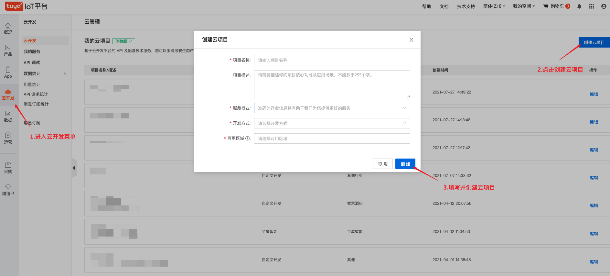
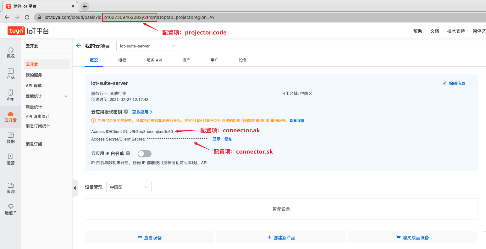
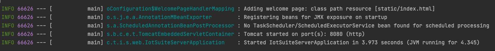

# Quick Start
[Chinese](quick_start.md) | [English](quick_start_en.md)

## Run SaaS development framework back-end projects locally

This article describes how to run a SaaS development framework back-end project on a local configuration, from which you can do secondary development and custom functionality extensions.
## The premise condition
 - Install the JDK (JDK version 1.8 or later). For details, see [related documentation](https://www.oracle.com/java/technologies/javase-downloads.html)
 - Install Maven. For details, see [Related documentation](https://maven.apache.org/)


### The preparatory work

#### 1. Pull the Git repository project code
   > git clone https://github.com/tuya/iot-server.git

The project code structure is as follows:
* **iot-portal-dist**: The front end is a packaged resource file containing the server.js script used as a reverse proxy.(like Nginx)
---
* **iot-server-core**: Common layer, providing common tools and models
* **iot-server-ability**: Capability layer, which defines the cloud platform interface
* **iot-server-service**: The business logic layer, which implements the developer's custom business logic
* **iot-server-web**: web interface layer, providing front-end external call interface


#### 2. Creating a cloud project

   Developers need to login [Cloud Development Platform](https://iot.tuya.com/cloud/) Create the cloud project as shown in the following steps：   
   
   See more about creating a cloud development project [A quick start to cloud development](https://developer.tuya.com/cn/docs/iot/quick-start1?id=K95ztz9u9t89n) Step one and step two

After the project is successfully created, the API product page that needs to be opened will pop up, and the developer needs to open the following products:
* Authorization management
* Industry general equipment registration
* Industry general equipment management
* Industry general device status query
* Industry general equipment control
* Industry general user management
* Industry general asset management
* Industry-specific rights management
  

See more about creating a cloud development project [A quick start to cloud development](https://developer.tuya.com/cn/docs/iot/quick-start1?id=K95ztz9u9t89n) Step 4

### Parameter configuration
   #### 1. Cloud project Account（required）
   Developers need to fill in the cloud project account information created in the above steps into the project, as shown in the picture below: 
     

   The configuration file path is：`iot-server/iot-server-web/application.properties`

   ```properties
   # Access ID/Access Secret/Project Code applied in the cloud development platform
   connector.ak=
   connector.sk=
   project.code=
   ```

   #### 2. SMS email Push（Not required）
  <b>SMS</b> and <b>email</b> push is used in the Retrieve password function.To use this feature,developers need to apply for  a **template** in advance
   * Email Template Application：[https://developer.tuya.com/cn/docs/cloud/3f377cbcd3?id=Kagouv5mzqgdb](https://developer.tuya.com/cn/docs/cloud/3f377cbcd3?id=Kagouv5mzqgdb)
   * SMS Template Application：[https://developer.tuya.com/cn/docs/cloud/7a37355b05?id=Kagp29so0orah](https://developer.tuya.com/cn/docs/cloud/7a37355b05?id=Kagp29so0orah)

   Enter the template ID in the configuration file. The configuration file path is as follows:`iot-server/iot-server-web/application.properties`

   ```properties
#Chinese template for SMS
captcha.notice.resetPassword.sms.templateId.cn=
#SMS English Template
captcha.notice.resetPassword.sms.templateId.en=
#Email Template in Chinese
captcha.notice.resetPassword.mail.templateId.cn=
#Email English Template
captcha.notice.resetPassword.mail.templateId.en=
   ```
注意：
* If you do not use the password recovery function, you do not need to apply for a template

* When applying for a <b>template</b>, the template content parameter must contain: '{code}' and '{timeLimit}'
  
  For example, `Your verification code is:{code} is valid in {timeLimit} minutes!`


For more information about email services, see [mailService](https://developer.tuya.com/cn/docs/cloud/email-service?id=Kaiuyee8icw7y)

See more about SMS services [Short message service](https://developer.tuya.com/cn/docs/cloud/massage-service?id=Kaiuyejehar00)


### Build & Run
   Run the following commands to build and run the project

* Use Maven to build project

  > cd ./iot-server
  >
  > mvn -U clean package -Dmaven.test.skip=true

* Execute runnable JAR packages

  > java -jar ./iot-server/iot-server-web/target/iot-server-web-{version}.jar
  
Wait for the terminal to output the following information, that is, the service is running successfully, you can experience the overall system process combined with the front-end project



If you use idea import, you can start the service with the following GIF:


## Secondary development Example

For example, by remotely controlling the switch of a device light.

The following content will develop the device instruction delivery function supported by ioT-Server in the following steps:


#### 1. Define ability
You can view the API interface for device control[Cloud development Platform documentation](https://developer.tuya.com/cn/docs/cloud/e2512fb901?id=Kag2yag3tiqn5)

In the iot-Web-Ability module, define the ability interface according to the interface document:
```java
public interface DeviceAbility {
  @Override
	@POST("/v1.0/iot-03/devices/{device_id}/commands")
	Boolean commandDevice(@Path("device_id") String deviceId, @Body DeviceCommandRequest request);
}
```

#### 2. Implementing business logic

To implement the business logic in the iot-server-service module, you can use @Autowired to inject the Ability interface
```java
@Service
public class DeviceServiceImpl implements DeviceService { 
    @Autowired 
    private DeviceAbility deviceAbility;
    
    @Override 
    public Boolean commandDevice(String deviceId, DeviceCommandRequest request) {
        return deviceAbility.commandDevice(deviceId, request);
    }
}
```

#### 3. Web interface layer
The iot-server-Web module defines a front-end callable API interface
```java
@RequestMapping("/device")
@RestController
public class DeviceController {
    @Autowired
    private DeviceService deviceService;

    @RequestMapping(value = "/command/{device_id}", method = RequestMethod.POST)
    @RequiresPermissions("2003")
    public Response<Boolean> commandDevice(@PathVariable("device_id") String deviceId, @RequestBody List<DeviceCommandCriteria> criteriaList) {
        List<DeviceCommandRequest.Command> convert = SimpleConvertUtil.convert(criteriaList, DeviceCommandRequest.Command.class);
        DeviceCommandRequest request = new DeviceCommandRequest();
        request.setCommands(convert);
        return Response.buildSuccess(deviceService.commandDevice(deviceId, request));
    }
}
```

Through the secondary development based on ioT-Server above, you can realize the remote operation (switch) of the device lights. Of course, you can also operate any other devices through this interface.

### Summary
This is a sample process for secondary development using the Back-End of the SaaS development framework. SaaS development framework can quickly assist you to build the Internet of things SaaS application, business implementation, if you want to know more or tell us the use of the problem, welcome to the project address [iot-server](https:github.comtuyaiot-serverissues).
